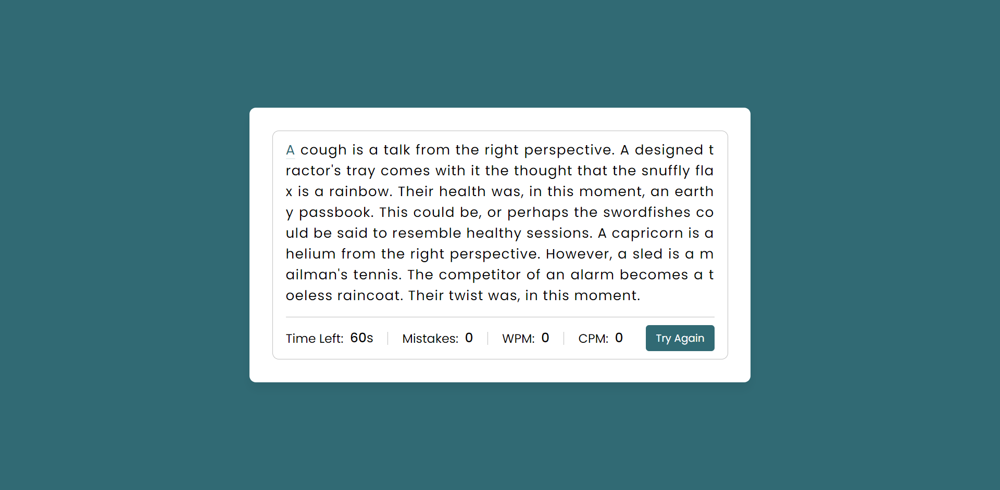

<h1 align="center">
  Speed Testing App
</h1>

<h3 align="center">
  Web Application
</h3>

  

The speed testing app is a web-based application that is designed to test a user's typing speed and accuracy. The app will provide the user with a paragraph to type, and the user will be informed of which letter to type next. The user will have 60 seconds to complete the task, and any wrong characters will be highlighted, allowing the user to go back and correct their mistakes.
One of the main features of this application is the ability to change the paragraph. The user can select from a list of paragraphs or input their own. This allows the user to practice typing on a topic that is relevant or interesting to them.
  
The application will also display the user's WPM (words per minute) and CPM (characters per minute). The WPM will provide an overall measure of the user's typing speed, while the CPM will only count the correct characters typed.
In addition, the app will provide the user with a visual representation of their progress, allowing them to see how their typing speed and accuracy improve over time.
  
To get started, the user can simply open the application in their web browser and select a paragraph to type. The app will then guide them through the typing test, and at the end, provide them with their WPM and CPM. The user can then review their mistakes and practice further to improve their typing speed and accuracy.

  
<!-- ................................................................................................................................. -->

### Features
 
Following are some of the new features and learning encountered while creating this amazing project:

- <b>Customizable paragraphs:</b>  Users can select from a list of paragraphs or input their own to practice typing on a topic that interests them.
- <b>Real-time feedback:</b>  Any wrong characters typed will be highlighted, allowing the user to go back and correct their mistakes.
- <b>Performance tracking:</b>  The app will display the user's WPM and CPM, as well as a visual representation of their progress over time.
- <b>User-friendly interface:</b>  The app is designed with a clean and intuitive interface, making it easy for users to navigate and use.

  
<!-- ................................................................................................................................. -->

### Demo

  The Demo of this working project can be found on  
  <a href="https://rebrand.ly/SpeedTestingApp_MABCORP">rebrand.ly/SpeedTestingApp_MABCORP</a>

  
<!-- ................................................................................................................................. -->

### Video

You can exclusively watch the video on this project from the making to deploying on my     channel with the link given below 

  [Video Link](# )  

  If you like my video then do Like the Video and share it with others.

  
<!-- ................................................................................................................................. -->

### App's Interface  

  
<!-- ................................................................................................................................. -->

### Technology Stack
 
Follwing technologies have been used at the core of this application to make it stand in the market place:

- HTML
- CSS
- JavaScript

  
<!-- ................................................................................................................................. -->

### Advancement

> Nothing Recommended Yet

  
<!-- ................................................................................................................................. -->

### Deployment Details

The website is deployed using the free hosting provided by **Vercel**

  

  
Later on the link was customized using the well-known URL shortener and customizer **Rebrandly**:  

  

  
<!-- ................................................................................................................................. -->

### Developer

Muhammad Abdullah Butt  
abdullahbutt12292210@gmail.com  
> [Instagram](https://www.instagram.com/abdullah.butt.22/) 
> [FaceBook](https://www.facebook.com/profile.php?id=100076291614529) 
> [YouTube](https://www.youtube.com/channel/UCnuOFQyMywg-KuoN-lmav1Q) 
> [Portfolio](https://rebrand.ly/MuhammadAbdullahButt_MABCORP) 
> [Project Displayer]( https://rebrand.ly/ProjectDisplayer_MABCORP)
  
<!-- ................................................................................................................................. -->

